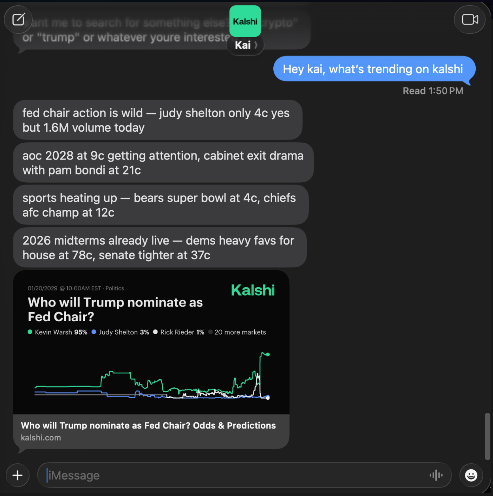

# Kalshi Agent

A prediction market trading agent for [Kalshi](https://kalshi.com), accessible via iMessage. Built on [Linq Blue](https://linqapp.com) and powered by Claude (Anthropic).



## What it does

- **Trade via text** — buy, sell, and cancel orders on Kalshi through iMessage
- **Search & analyze markets** — browse trending markets, check prices, volume, and orderbook depth
- **Portfolio tracking** — check balance, positions, and P&L with a text
- **Multi-user onboarding** — each user connects their own Kalshi account via a magic link, no shared credentials

## Architecture

```
User ──iMessage──▶ Linq Blue ──webhook──▶ kalshi-agent ──▶ Claude (Anthropic)
                                              │                    │
                                              │     ◀── tools ◀────┘
                                              │     (market search,
                                              │      trading, web
                                              │      search)
                                              │                    │
                                              ▼                    ▼
User ◀─iMessage── Linq Blue ◀───API──── Response          Kalshi API
```

## Quick Start

### Prerequisites

- [Node.js](https://nodejs.org) 20+
- [ngrok](https://ngrok.com) (for local development)
- [Linq Blue](https://linqapp.com) account (free sandbox)
- [Kalshi](https://kalshi.com) account with API access
- [Anthropic](https://console.anthropic.com) API key

### Setup

```bash
# Clone the repo
git clone https://github.com/linq-team/kalshi-agent.git
cd kalshi-agent

# Install dependencies
npm install

# Copy environment template
cp .env.example .env
```

Edit `.env` and fill in your keys. At minimum you need:

- `ANTHROPIC_API_KEY` — from [console.anthropic.com](https://console.anthropic.com)
- `LINQ_API_TOKEN` — from your Linq Blue dashboard
- `LINQ_AGENT_BOT_NUMBERS` — your Linq Blue phone number

Generate an encryption key for credential storage:

```bash
node -e "console.log(require('crypto').randomBytes(32).toString('hex'))"
```

Paste the output into `CREDENTIAL_ENCRYPTION_KEY` in your `.env`.

### Run

```bash
# Start the dev server
npm run dev

# In another terminal, expose via ngrok
ngrok http 3000
```

Copy the ngrok URL and set it as your webhook URL in the [Linq Blue dashboard](https://linqapp.com). Then text your Linq Blue number — you'll get a magic link to connect your Kalshi account, and you're trading.

## Environment Variables

| Variable | Required | Description |
|----------|----------|-------------|
| `ANTHROPIC_API_KEY` | Yes | Claude API key |
| `LINQ_API_TOKEN` | Yes | Linq Blue partner token |
| `LINQ_AGENT_BOT_NUMBERS` | Yes | Your Linq Blue phone number(s), comma-separated |
| `BASE_URL` | Yes | Public URL for magic link generation (e.g. your ngrok URL) |
| `CREDENTIAL_ENCRYPTION_KEY` | Yes | 64 hex chars for encrypting stored Kalshi credentials |
| `KALSHI_API_KEY_ID` | No | Default Kalshi API key ID (for public market data before users onboard) |
| `KALSHI_PRIVATE_KEY_PATH` | No | Path to default Kalshi private key `.pem` |
| `PORT` | No | Server port (default: 3000) |
| `NODE_ENV` | No | Set to `production` for HTTPS enforcement |
| `ALLOWED_SENDERS` | No | Lock to specific phone numbers during dev, comma-separated |
| `IGNORED_SENDERS` | No | Phone numbers to ignore, comma-separated |

## How it works

1. User texts the Linq Blue number via iMessage
2. Linq Blue sends a webhook to your server
3. If the user hasn't onboarded, they get a magic link to connect their Kalshi account
4. The agent sends the message to Claude with Kalshi tools available
5. Claude can search markets, check prices, place trades, view portfolio — all via tool use
6. The response is sent back through Linq Blue as iMessage(s)

### Everything runs locally

There is no remote database or external auth service. Everything lives on your machine (or your single deployment):

- **User credentials** — Kalshi API keys are encrypted with AES-256-GCM and stored in-memory on the server process. They exist only in RAM and are lost on restart.
- **Conversation history** — kept in-memory per chat with a 1-hour TTL. No persistence layer needed.
- **User profiles** — names and facts Claude learns about users are stored in-memory on the server.
- **Onboarding** — when a new user texts the bot, they receive a magic link pointing to your server's `/auth/setup` page. They paste their Kalshi API key ID and private key into the form, which submits directly to your server. Credentials never leave your infrastructure.

## Project Structure

```
src/
├── index.ts              # Express server, webhook handler, main flow
├── auth/                 # Magic link onboarding, credential encryption
│   ├── routes.ts         # /auth/setup page and credential submission
│   ├── encryption.ts     # AES-256-GCM credential encryption
│   ├── magicLink.ts      # Token generation and verification
│   ├── db.ts             # In-memory user store
│   └── userContext.ts    # Load decrypted credentials per request
├── claude/
│   └── client.ts         # Claude API, system prompt, Kalshi tools
├── kalshi/
│   ├── client.ts         # Full Kalshi REST API client
│   ├── signing.ts        # RSA-PSS request signing
│   └── types.ts          # Kalshi API type definitions
├── linq/
│   └── client.ts         # Linq Blue API (send messages, reactions, effects)
├── state/
│   └── conversation.ts   # Conversation history and user profiles (in-memory)
├── utils/
│   └── redact.ts         # Phone number redaction for logs
└── webhook/
    ├── handler.ts        # Webhook processing and phone filtering
    └── types.ts          # Webhook event types
```

## Commands

Users can text these commands:

| Command | Description |
|---------|-------------|
| `/clear` | Reset conversation history |
| `/forget me` | Erase everything Kai knows about you |
| `/help` | Show available commands |
| `/portfolio` | Quick portfolio check |
| `/markets` | Trending/active markets |

## Deployment

### Docker

```bash
docker build -t kalshi-agent .
docker run -p 3000:3000 --env-file .env kalshi-agent
```

### Railway / Fly.io

Set your environment variables in the platform dashboard and deploy. The included `Dockerfile` and `Procfile` handle the rest. Set `BASE_URL` to your deployment URL for magic links to work.

## Built with

- [Linq Blue](https://linqapp.com) — iMessage/RCS API
- [Claude](https://anthropic.com) (Anthropic) — AI reasoning and tool use
- [Kalshi API](https://kalshi.com) — prediction market trading

## Contributing

Pull requests welcome. Branch off `dev`, open a PR, and keep changes focused.

## License

MIT
